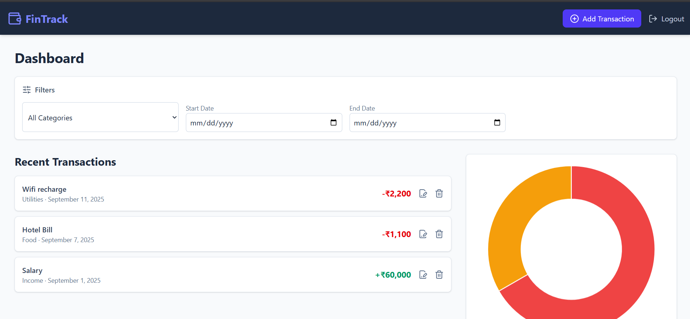
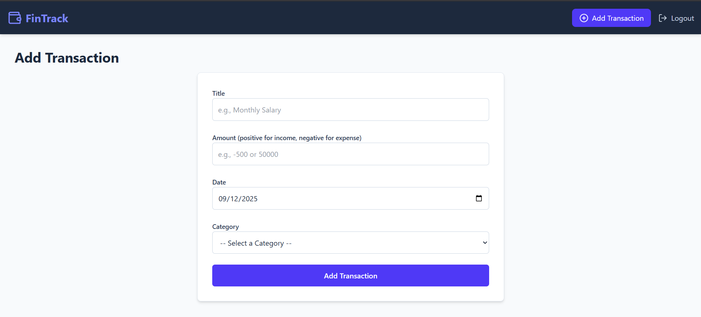
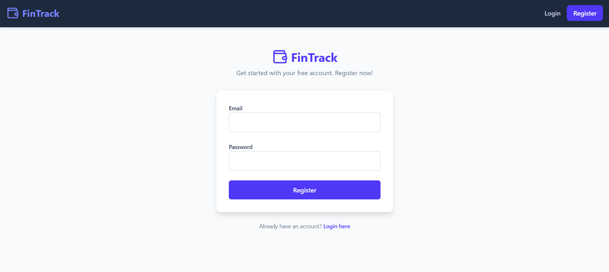
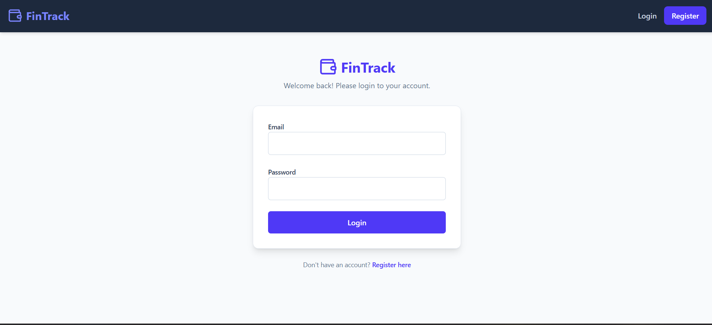

# 💸 FinTrack - Expense Tracker App



**FinTrack** is a modern full-stack expense tracker application designed to help you manage and visualize your income and expenses with ease. With a sleek UI, secure authentication, and interactive charts, FinTrack makes personal finance management simple and intuitive.

---

## 🚀 Features

### ✨ Modern UI
- Clean, responsive design built with Tailwind CSS
- Smooth transitions and intuitive navigation

### 🔒 Secure Authentication
- User registration and login with JWT
- Protected routes for authenticated users
- Passwords encrypted using bcrypt

### 💰 Expense Management
- Add, edit, and delete transactions
- Categorize transactions (e.g., Food, Utilities, Income, etc.)
- Filter by date range and categories
- Real-time feedback with toast notifications

### 📊 Data Visualization
- Interactive charts using Chart.js and react-chartjs-2
- Clear breakdown of expenses by category
- Dashboard with recent transactions and spending insights

---

## 🖥️ Screenshots






---

## 🛠️ Tech Stack

### 🔧 Frontend
- React.js (Vite)
- Tailwind CSS
- Axios
- React Router DOM
- Lucide React Icons
- React Hot Toast
- Chart.js & React Chart.js 2

### 🖥️ Backend
- Node.js
- Express.js
- MongoDB with Mongoose
- JWT Authentication
- Bcrypt for password hashing

---

## 🌐 Live Demo

> 🚀 [FinTrack Live](https://your-live-demo-link.com)  
> *(Hosted using Render / Vercel — may take a few seconds to wake up if idle)*

---

## 📦 Installation

### ⚙️ Prerequisites
- Node.js (v18+ recommended)
- MongoDB Atlas account (or local MongoDB)
- Git

### 📁 Clone the Repository
```bash
git clone https://github.com/Priyanshu-010/Expense-Tracker-MERN

> ⚙️ Backend Setup
cd backend
npm install

- Create a .env file inside backend with the following:

PORT=3000
MONGO_URI=your_mongodb_connection_string
JWT_SECRET=your_jwt_secret

- Start backend

npm run dev

>🎨 Frontend Setup 

cd ../frontend
npm install

- Start frontend

npm run dev

---

👤 About the Developer
Priyanshu Rai
📧 priyanshurai2772@gmail.com
🔗 LinkedIn: (https://www.linkedin.com/in/priyanshuraidev/)
💻 GitHub: (https://github.com/Priyanshu-010)

---

